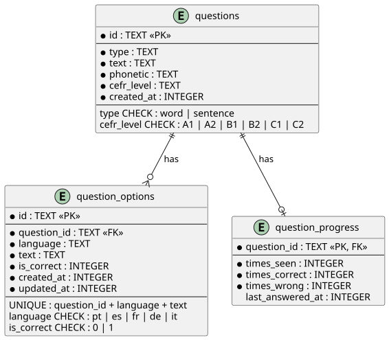

# Fluently

[](https://github.com/anton3x/Fluently/actions/workflows/cicd.yml)
[](https://sonarcloud.io/summary/new_code?id=anton3x_Fluently)
[](https://sonarcloud.io/summary/new_code?id=anton3x_Fluently)
[](https://github.com/RichardLitt/standard-readme)

**Fluently is a private, offline-first vocabulary trainer for learning English with your own questions.**

Create or import your own vocabulary questions, practice them one at a time, and keep your progress entirely on your device. No account, no backend, and no internet connection are required for everyday use.

The goal is simple: **make vocabulary practice personal, portable, and independent of the internet.**

## Table of Contents

- [Background](#background)
- [Features](#features)
- [Requirements](#requirements)
- [Install](#install)
- [Usage](#usage)
- [Development](#development)
- [Native Development Builds](#native-development-builds)
- [Database](#database)
- [Project Structure](#project-structure)
- [Tech Stack](#tech-stack)
- [Roadmap](#roadmap)
- [Contributing](#contributing)
- [License](#license)

## Background

Fluently started as a personal project to practice English vocabulary without relying on online services. It is designed to be a simple, private, and offline-first vocabulary trainer where learners can create their own questions and keep their learning data entirely on their device.

## Features

### Offline first

Fluently is designed to work without an internet connection. Learning sessions, questions, progress, settings, and other application data are stored locally.

Internet access is not required for the core learning experience.

### Your questions, your learning

Fluently does not provide a centralized question database that dictates what you should learn.

You can build your own questions around the vocabulary you actually want to remember and import them into the app.

This makes Fluently useful for:

- Vocabulary encountered while reading books or articles.
- Words encountered at work or school.
- Personal study lists.
- Words that are difficult to remember.
- Custom language-learning material.

### No account required

There is no authentication system and no user account.

Your learning data is local to your device instead of being tied to an online identity.

### Own your progress

Your learning progress should not be trapped inside a server or tied to a particular installation.

Fluently is being designed with device-to-device migration in mind, allowing users to eventually transfer their questions and progress directly between devices without relying on a cloud account.

## Requirements

Before getting started, make sure you have:

- [Bun](https://bun.sh/) installed.
- [Node.js](https://nodejs.org/) installed if you intend to use Expo or EAS CLI directly.
- [Expo Go](https://expo.dev/go/) for running the app on a physical device.
- Android Studio for Android native development.
- macOS and Xcode for iOS native development.

## Install

Clone the repository and install its dependencies:

```bash
bun install
```

## Usage

Start the Expo development server:

```bash
bun run start
```

From the Expo CLI, you can:

- Press `a` to open the app on Android.
- Press `i` to open the app on iOS on macOS.
- Scan the QR code with Expo Go to run the app on a physical device.

The platform-specific scripts are also available:

```bash
bun run android
bun run ios
```

## Development

### Quality Checks

Run the project's static checks:

```bash
bun run typecheck
bun run lint
bun run format:check
bun run db:check
```

Run the test suite with coverage:

```bash
bun run test:ci
```

Format the project:

```bash
bun run format
```

### Database Migrations

Generate Drizzle migrations after changing the database schema:

```bash
bun run db:generate
```

## Native Development Builds

Use native development builds when you need functionality that is not available through Expo Go or when working directly with the native projects.

Run the Android development build:

```bash
bunx expo run:android
```

Run the iOS development build:

```bash
bunx expo run:ios
```

Android development requires Android Studio.

iOS development requires macOS and Xcode.

## Database

Fluently uses **Expo SQLite** for local persistence and **Drizzle ORM** for type-safe database access and schema management.

The database stores the local learning state required by the application, including questions, practice data, and persisted settings.

### Database Diagram



The database diagram is maintained alongside the project to make the local data model easier to understand and review.

## Project Structure

```text
src/
├── app/                       # Expo Router routes
│   ├── (onboarding)/         # Welcome and setup flow
│   └── (main)/               # Learn and settings screens
├── components/               # Shared UI components
├── db/                       # Database schema and access
├── features/
│   ├── questions/            # Practice, import, and question data
│   └── notifications/        # Daily reminder service
├── i18n/                     # Translation resources
└── stores/                   # Persisted application settings
```

## Tech Stack

- [Expo](https://expo.dev/) SDK 57
- [React Native](https://reactnative.dev/) 0.86
- [HeroUI Native](https://www.heroui.com/)
- [Uniwind](https://uniwind.dev/)
- [Tailwind CSS](https://tailwindcss.com/)
- [TanStack Query](https://tanstack.com/query)
- [Zustand](https://zustand.docs.pmnd.rs/)
- [Drizzle ORM](https://orm.drizzle.team/)
- [Expo SQLite](https://docs.expo.dev/versions/latest/sdk/sqlite/)

## Roadmap

The following capabilities are planned or under development:

- [ ] Device-to-device migration of questions and learning progress.
- [ ] Additional learning and progress features.

## Contributing

Contributions, bug reports, and suggestions are welcome.

Before opening a pull request, run the project's checks:

```bash
bun run typecheck
bun run lint
bun run format:check
bun run db:check
bun run test:ci
```

For larger changes, consider opening an issue first to discuss the proposed approach.

## License

See the `LICENSE` file in the repository for license information.
